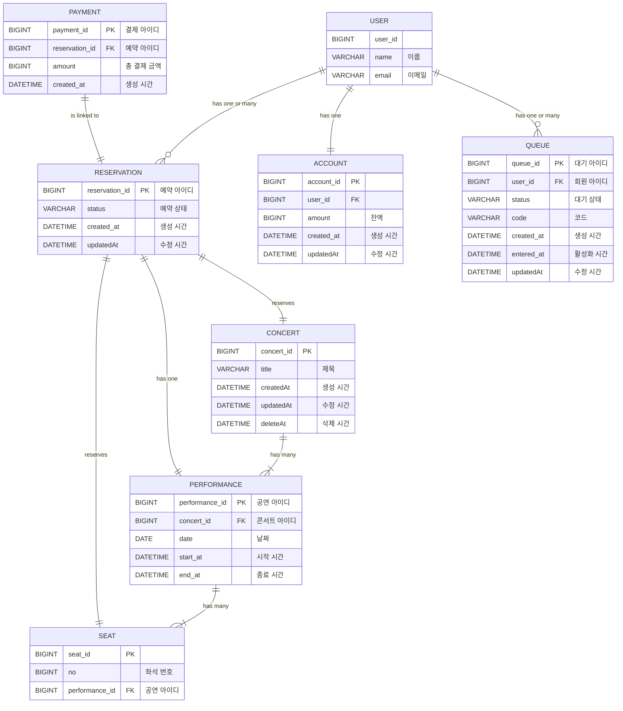

# 시퀀스다이어그램

```mermaid
erDiagram
    CONCERT {
        BIGINT concert_id PK
        VARCHAR title "제목"
        DATETIME createdAt "생성 시간"
        DATETIME updatedAt "수정 시간"
        DATETIME deleteAt "삭제 시간"
    }

    PERFORMANCE {
        BIGINT performance_id PK "공연 아이디"
        BIGINT concert_id FK "콘서트 아이디"
        DATE date "날짜"
        DATETIME start_at "시작 시간"
        DATETIME end_at "종료 시간"
    }

    SEAT {
        BIGINT seat_id PK
        BIGINT no "좌석 번호"
        BIGINT performance_id FK "공연 아이디"
    }

    RESERVATION {
        BIGINT reservation_id PK "예약 아이디"
        VARCHAR status "예약 상태"
        DATETIME created_at "생성 시간"
        DATETIME updatedAt "수정 시간"
    }

    PAYMENT {
        BIGINT payment_id PK "결제 아이디"
        BIGINT reservation_id FK "예약 아이디"
        BIGINT amount "총 결제 금액"
        DATETIME created_at "생성 시간"
    }

    USER {
        BIGINT user_id
        VARCHAR name "이름"
        VARCHAR email "이메일"
    }

    ACCOUNT {
        BIGINT account_id PK
        BIGINT user_id FK
        BIGINT amount "잔액"
        DATETIME created_at "생성 시간"
        DATETIME updatedAt "수정 시간"
    }

    QUEUE {
        BIGINT queue_id PK "대기 아이디"
        BIGINT user_id FK "회원 아이디"
        VARCHAR status "대기 상태"
        VARCHAR code "코드"
        DATETIME created_at "생성 시간"
        DATETIME entered_at "활성화 시간"
        DATETIME updatedAt "수정 시간"
    }

    RESERVATION ||--|| CONCERT: "reserves"
    RESERVATION ||--|| PERFORMANCE: "has one"
    RESERVATION ||--|| SEAT: "reserves"
    PAYMENT ||--|| RESERVATION: "is linked to"
    CONCERT ||--|{ PERFORMANCE: "has many"
    PERFORMANCE ||--|{ SEAT: "has many"
    USER ||--o{ RESERVATION: "has one or many"
    USER ||--|| ACCOUNT: "has one"
    USER ||--o{ QUEUE: "has one or many"

```

