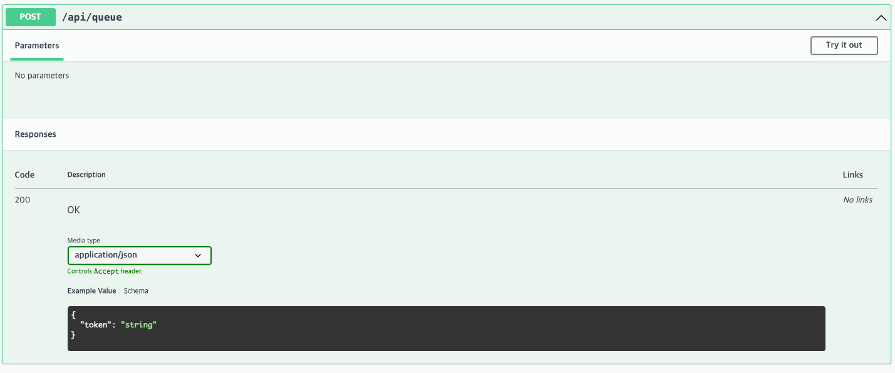
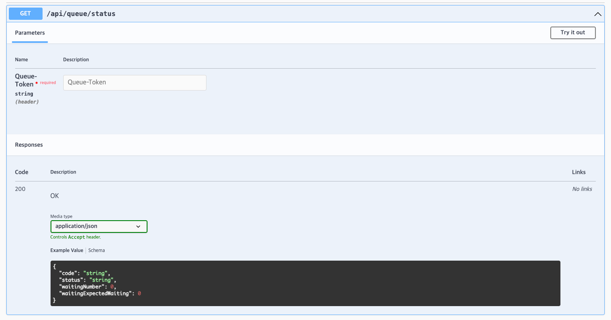
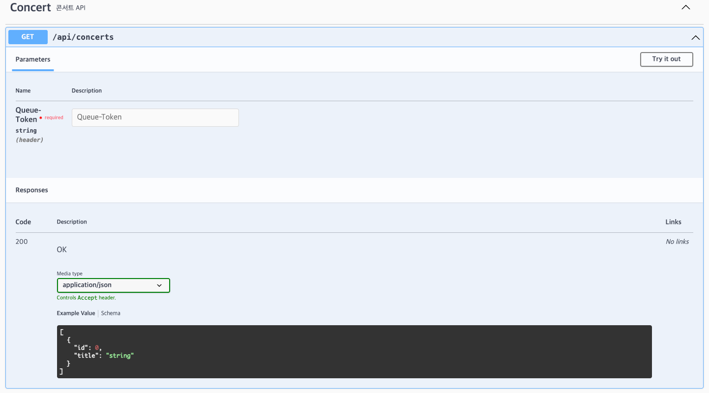
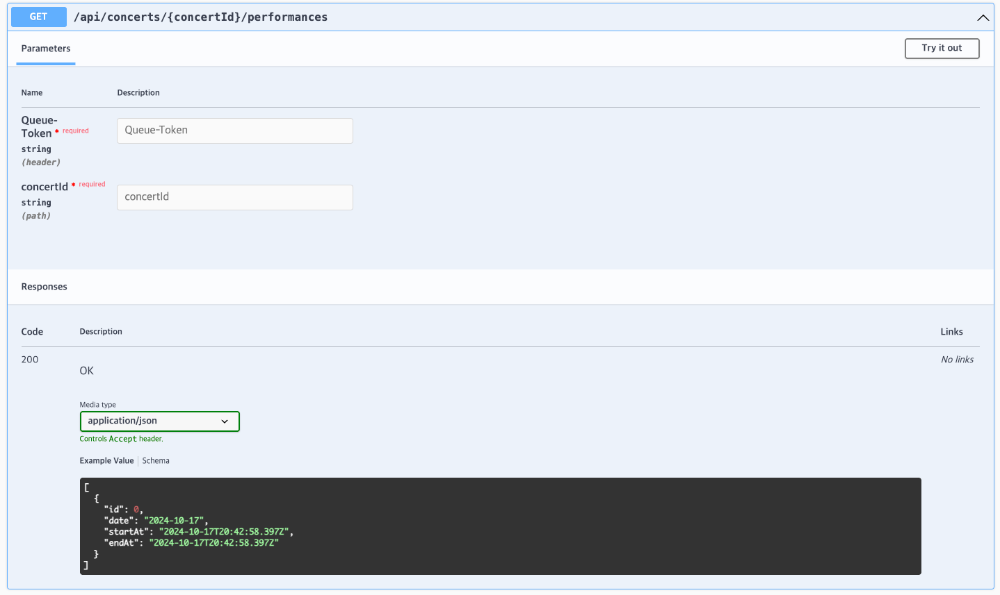
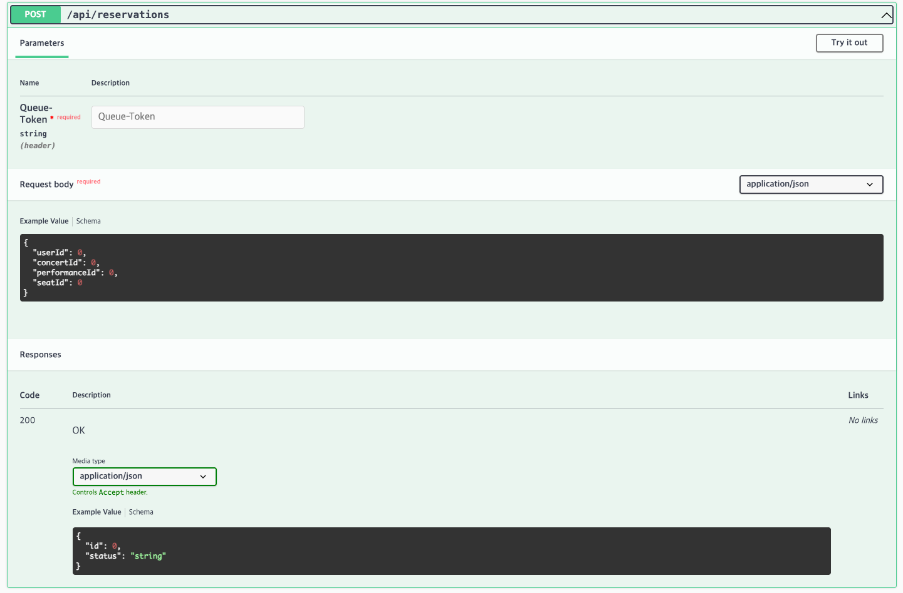
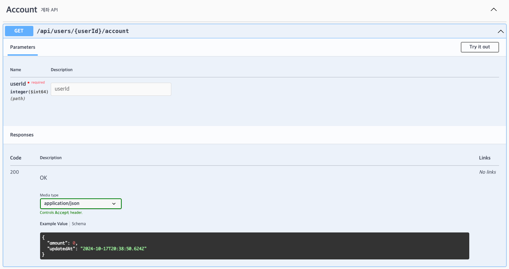
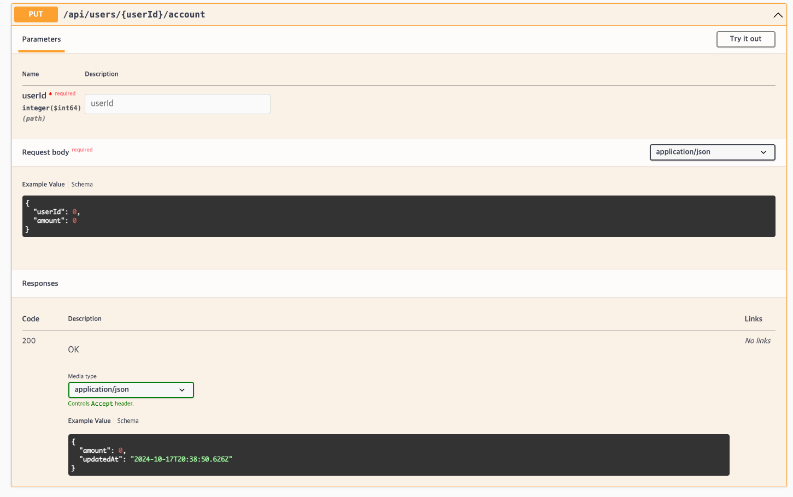

# Swagger API 명세서

## 1. 대기열 등록 API

---

## 2. 대기열 상태 조회 API

---

## 3. 콘서트 조회 API

---

## 4. 콘서트 공연 조회 API

---

## 5. 콘서트 공연 좌석 조회 API

---

## 6. 콘서트 예약  API

---

## 7. 예약 결제  API

---

## 8. 잔액 조회  API

---

## 9. 잔액 충전  API

---
