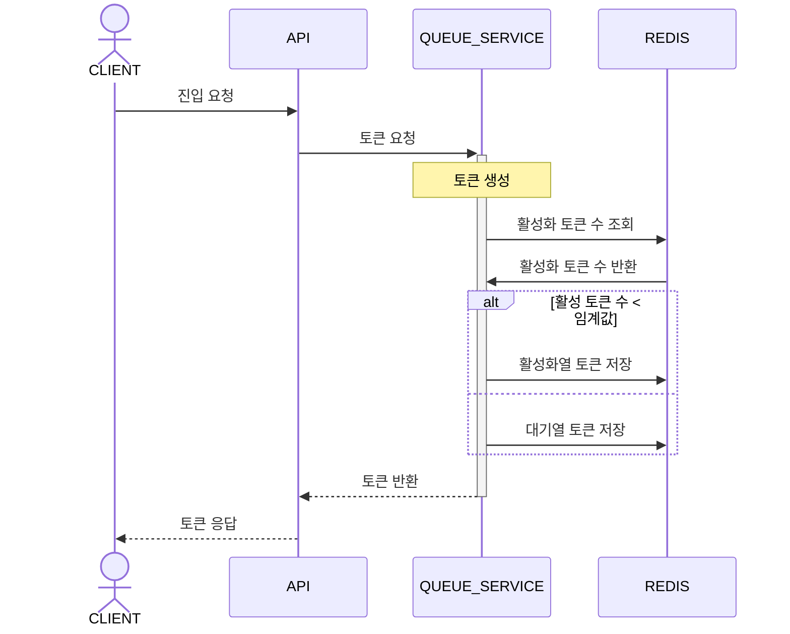
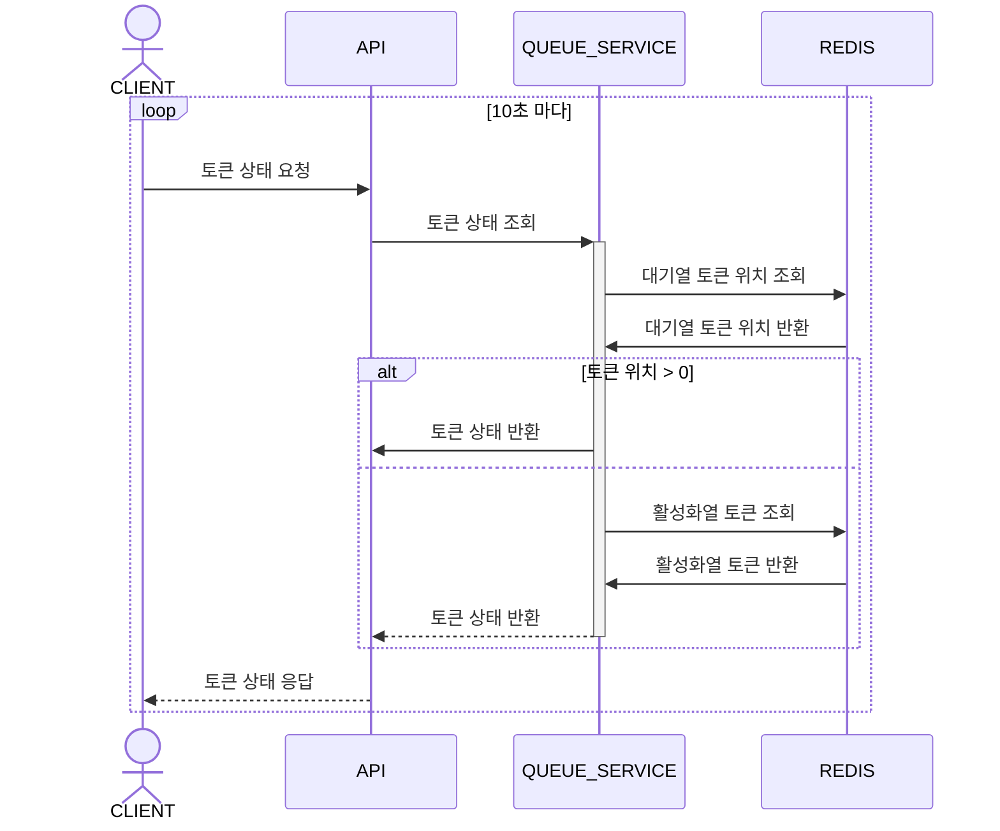
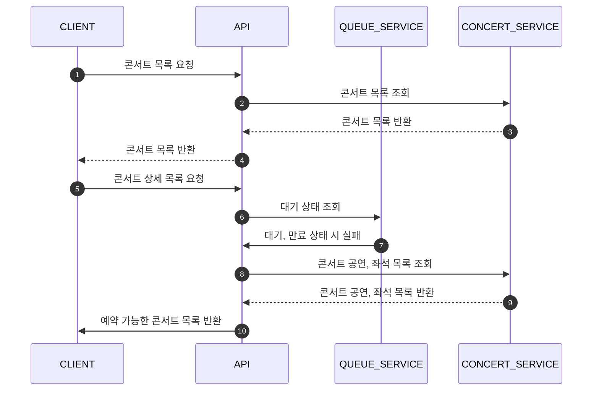
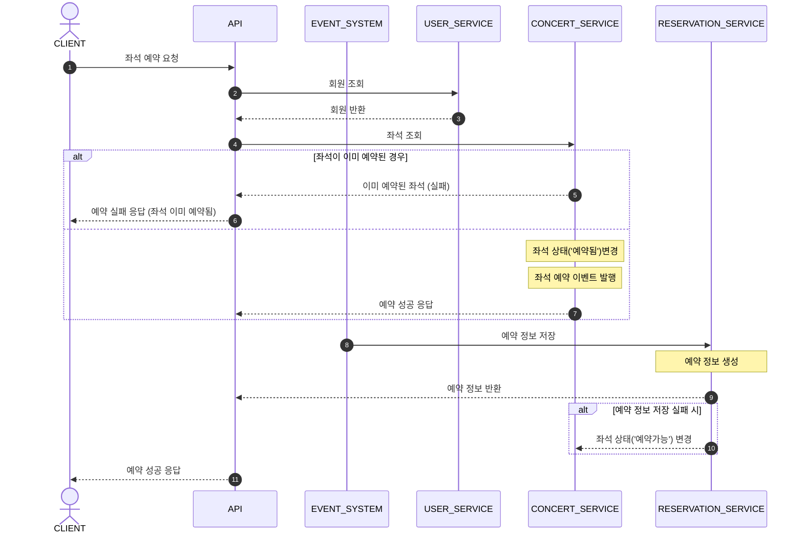
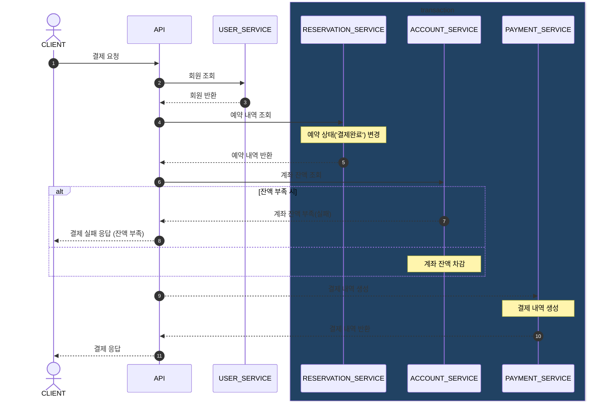
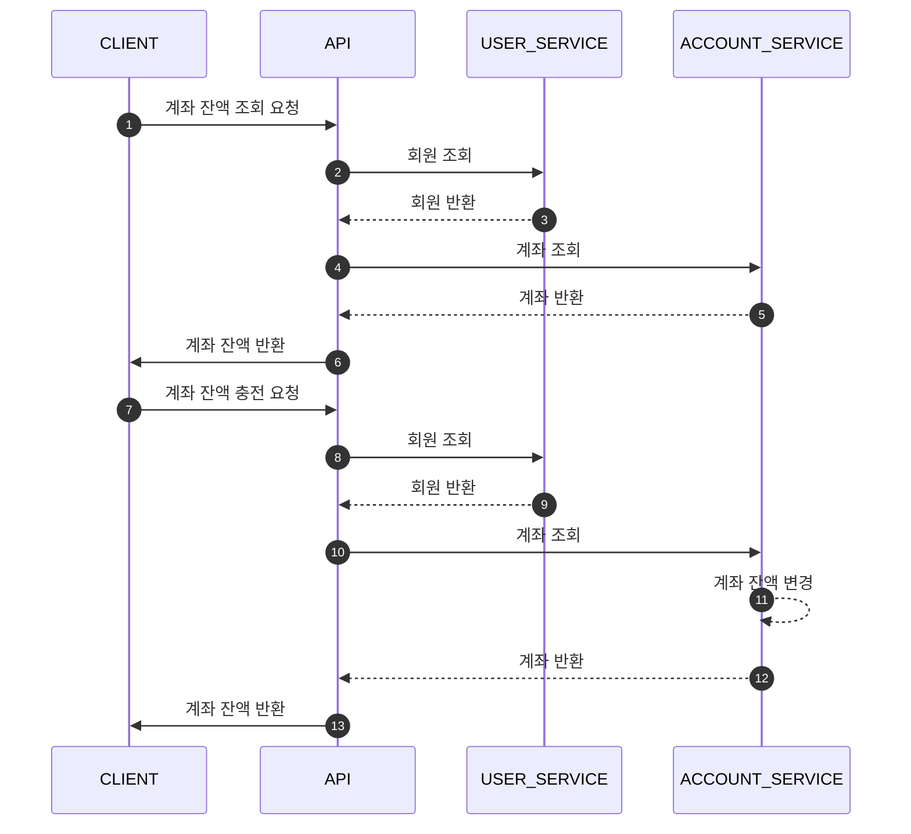

# 시퀀스다이어그램

## 1. 대기열 서비스

### 1-1. 대기열 진입

```mermaid
sequenceDiagram
    actor CLIENT
    participant API
    participant QUEUE_SERVICE
    participant REDIS
%% Step 1: 대기열 진입 
    CLIENT ->> API: 진입 요청
    API ->> + QUEUE_SERVICE: 토큰 요청
    note over QUEUE_SERVICE: 토큰 생성
    QUEUE_SERVICE ->> REDIS: 활성화 토큰 수 조회
    REDIS ->> QUEUE_SERVICE: 활성화 토큰 수 반환
    alt 활성 토큰 수 < 임계값
        QUEUE_SERVICE ->> REDIS: 활성화열 토큰 저장
    else
        QUEUE_SERVICE ->> REDIS: 대기열 토큰 저장
    end
    QUEUE_SERVICE -->> - API: 토큰 반환
    API -->> CLIENT: 토큰 응답
```

### 1-2. 토큰 상태 확인

```mermaid
sequenceDiagram
    actor CLIENT
    participant API
    participant QUEUE_SERVICE
    participant REDIS
%% Step 2: 토큰 상태 확인  
    loop 10초 마다
        CLIENT ->> API: 토큰 상태 요청
        API ->> + QUEUE_SERVICE: 토큰 상태 조회
        QUEUE_SERVICE ->> REDIS: 대기열 토큰 위치 조회
        REDIS ->> QUEUE_SERVICE: 대기열 토큰 위치 반환
        alt 토큰 위치 > 0
            QUEUE_SERVICE ->> API: 토큰 상태 반환
        else
            QUEUE_SERVICE ->> REDIS: 활성화열 토큰 조회
            REDIS ->> QUEUE_SERVICE: 활성화열 토큰 반환
            QUEUE_SERVICE -->> - API: 토큰 상태 반환
        end
        API -->> CLIENT: 토큰 상태 응답
    end 
```

## 2. 콘서트 서비스

```mermaid
sequenceDiagram
    autonumber
    participant CLIENT
    participant API
    participant QUEUE_SERVICE
    participant CONCERT_SERVICE
    CLIENT ->> API: 콘서트 목록 요청
    API ->> CONCERT_SERVICE: 콘서트 목록 조회
    CONCERT_SERVICE -->> API: 콘서트 목록 반환
    API -->> CLIENT: 콘서트 목록 반환
    CLIENT ->> API: 콘서트 상세 목록 요청
    API ->> QUEUE_SERVICE: 대기 상태 조회
    QUEUE_SERVICE ->> API: 대기, 만료 상태 시 실패
    API ->> CONCERT_SERVICE: 콘서트 공연, 좌석 목록 조회
    CONCERT_SERVICE -->> API: 콘서트 공연, 좌석 목록 반환
    API ->> CLIENT: 예약 가능한 콘서트 목록 반환

```

## 3. 예약 서비스

```mermaid
sequenceDiagram
    autonumber
    actor CLIENT
    participant API
    participant EVENT_SYSTEM
    participant USER_SERVICE
    participant CONCERT_SERVICE
    participant RESERVATION_SERVICE
    CLIENT ->> API: 좌석 예약 요청
    API ->> USER_SERVICE: 회원 조회
    USER_SERVICE -->> API: 회원 반환
    API ->> CONCERT_SERVICE: 좌석 조회
    alt 좌석이 이미 예약된 경우
        CONCERT_SERVICE -->> API: 이미 예약된 좌석 (실패)
        API -->> CLIENT: 예약 실패 응답 (좌석 이미 예약됨)
    else
        note over CONCERT_SERVICE: 좌석 상태('예약됨')변경
        note over CONCERT_SERVICE: 좌석 예약 이벤트 발행
        CONCERT_SERVICE -->> API: 예약 성공 응답
    end
    EVENT_SYSTEM ->> RESERVATION_SERVICE: 예약 정보 저장
    note over RESERVATION_SERVICE: 예약 정보 생성
    RESERVATION_SERVICE -->> API: 예약 정보 반환
    alt 예약 정보 저장 실패 시
        RESERVATION_SERVICE -->> CONCERT_SERVICE: 좌석 상태('예약가능') 변경
    end
    API -->> CLIENT: 예약 성공 응답

```

## 4. 결제 서비스

```mermaid
sequenceDiagram
    autonumber
    actor CLIENT
    participant API
    participant USER_SERVICE
    box rgb(33,66,99) transaction
        participant RESERVATION_SERVICE
        participant ACCOUNT_SERVICE
        participant PAYMENT_SERVICE
    end
    CLIENT ->> API: 결제 요청
    API ->> USER_SERVICE: 회원 조회
    USER_SERVICE -->> API: 회원 반환
    API ->> RESERVATION_SERVICE: 예약 내역 조회
    note over RESERVATION_SERVICE: 예약 상태('결제완료') 변경
    RESERVATION_SERVICE -->> API: 예약 내역 반환
    API ->> ACCOUNT_SERVICE: 계좌 잔액 조회
    alt 잔액 부족 시
        ACCOUNT_SERVICE -->> API: 계좌 잔액 부족(실패)
        API -->> CLIENT: 결제 실패 응답 (잔액 부족)
    else
        note over ACCOUNT_SERVICE: 계좌 잔액 차감
    end
    API -->> PAYMENT_SERVICE: 결제 내역 생성
    note over PAYMENT_SERVICE: 결제 내역 생성
    PAYMENT_SERVICE -->> API: 결제 내역 반환
    API -->> CLIENT: 결제 응답
```

## 5. 계좌 서비스

```mermaid
sequenceDiagram
    autonumber
    participant CLIENT
    participant API
    participant USER_SERVICE
    participant ACCOUNT_SERVICE
    CLIENT ->> API: 계좌 잔액 조회 요청
    API ->> USER_SERVICE: 회원 조회
    USER_SERVICE -->> API: 회원 반환
    API ->> ACCOUNT_SERVICE: 계좌 조회
    ACCOUNT_SERVICE -->> API: 계좌 반환
    API ->> CLIENT: 계좌 잔액 반환
    CLIENT ->> API: 계좌 잔액 충전 요청
    API ->> USER_SERVICE: 회원 조회
    USER_SERVICE -->> API: 회원 반환
    API ->> ACCOUNT_SERVICE: 계좌 조회
    ACCOUNT_SERVICE -->> ACCOUNT_SERVICE: 계좌 잔액 변경
    ACCOUNT_SERVICE -->> API: 계좌 반환
    API ->> CLIENT: 계좌 잔액 반환
```