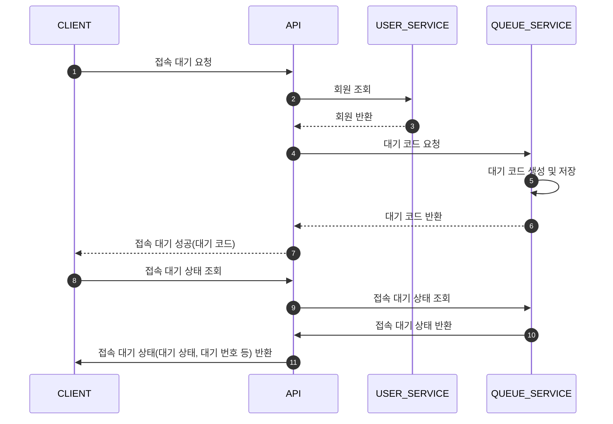
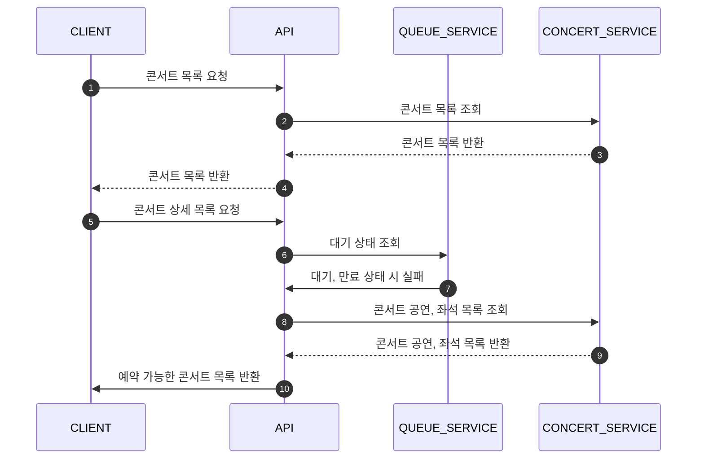
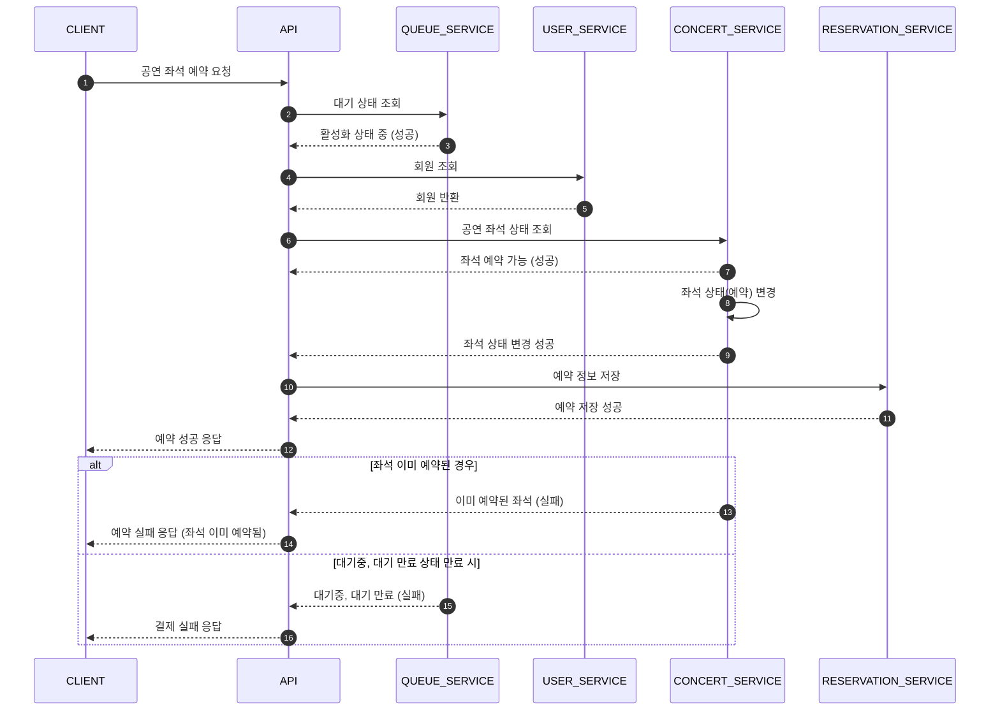
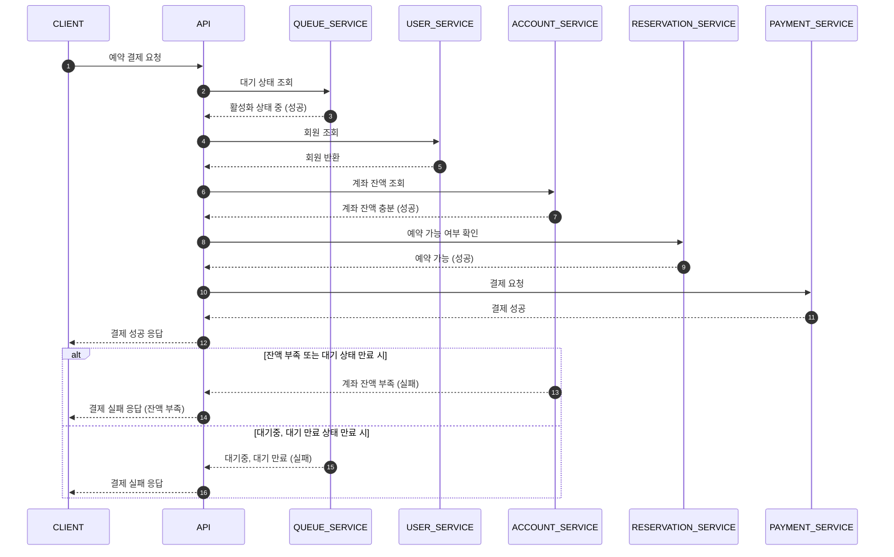
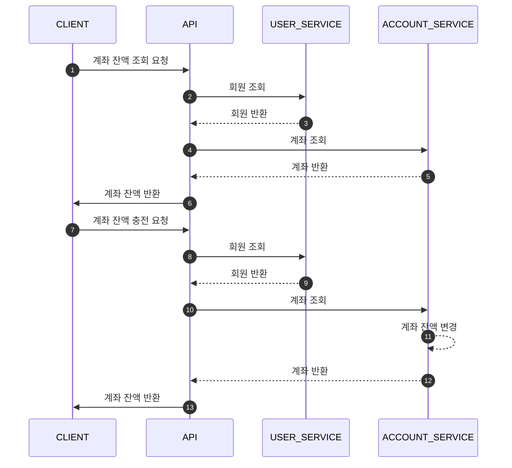

# 시퀀스다이어그램

## 1. 대기 서비스

```mermaid
sequenceDiagram
    autonumber
    participant CLIENT
    participant API
    participant USER_SERVICE
    participant QUEUE_SERVICE
    CLIENT ->> API: 접속 대기 요청
    API ->> USER_SERVICE: 회원 조회
    USER_SERVICE -->> API: 회원 반환
    API ->> QUEUE_SERVICE: 대기 코드 요청
    QUEUE_SERVICE ->> QUEUE_SERVICE: 대기 코드 생성 및 저장
    QUEUE_SERVICE -->> API: 대기 코드 반환
    API -->> CLIENT: 접속 대기 성공(대기 코드)
    CLIENT ->> API: 접속 대기 상태 조회
    API ->> QUEUE_SERVICE: 접속 대기 상태 조회
    QUEUE_SERVICE ->> API: 접속 대기 상태 반환
    API ->> CLIENT: 접속 대기 상태(대기 상태, 대기 번호 등) 반환

```

## 2. 콘서트 서비스

```mermaid
sequenceDiagram
    autonumber
    participant CLIENT
    participant API
    participant QUEUE_SERVICE
    participant CONCERT_SERVICE
    CLIENT ->> API: 콘서트 목록 요청
    API ->> CONCERT_SERVICE: 콘서트 목록 조회
    CONCERT_SERVICE -->> API: 콘서트 목록 반환
    API -->> CLIENT: 콘서트 목록 반환
    CLIENT ->> API: 콘서트 상세 목록 요청
    API ->> QUEUE_SERVICE: 대기 상태 조회
    QUEUE_SERVICE ->> API: 대기, 만료 상태 시 실패
    API ->> CONCERT_SERVICE: 콘서트 공연, 좌석 목록 조회
    CONCERT_SERVICE -->> API: 콘서트 공연, 좌석 목록 반환
    API ->> CLIENT: 예약 가능한 콘서트 목록 반환

```

## 3. 예약 서비스

```mermaid
sequenceDiagram
    autonumber
    participant CLIENT
    participant API
    participant QUEUE_SERVICE
    participant USER_SERVICE
    participant CONCERT_SERVICE
    participant RESERVATION_SERVICE
    CLIENT ->> API: 공연 좌석 예약 요청
    API ->> QUEUE_SERVICE: 대기 상태 조회
    QUEUE_SERVICE -->> API: 활성화 상태 중 (성공)
    API ->> USER_SERVICE: 회원 조회
    USER_SERVICE -->> API: 회원 반환
    API ->> CONCERT_SERVICE: 공연 좌석 상태 조회
    CONCERT_SERVICE -->> API: 좌석 예약 가능 (성공)
    CONCERT_SERVICE ->> CONCERT_SERVICE: 좌석 상태(예약) 변경
    CONCERT_SERVICE -->> API: 좌석 상태 변경 성공
    API ->> RESERVATION_SERVICE: 예약 정보 저장
    RESERVATION_SERVICE -->> API: 예약 저장 성공
    API -->> CLIENT: 예약 성공 응답

    alt 좌석 이미 예약된 경우
        CONCERT_SERVICE -->> API: 이미 예약된 좌석 (실패)
        API -->> CLIENT: 예약 실패 응답 (좌석 이미 예약됨)
    else 대기중, 대기 만료 상태 만료 시
        QUEUE_SERVICE -->> API: 대기중, 대기 만료 (실패)
        API -->> CLIENT: 결제 실패 응답
    end


```

## 4. 결제 서비스

```mermaid
sequenceDiagram
    autonumber
    participant CLIENT
    participant API
    participant QUEUE_SERVICE
    participant USER_SERVICE
    participant ACCOUNT_SERVICE
    participant RESERVATION_SERVICE
    participant PAYMENT_SERVICE
    CLIENT ->> API: 예약 결제 요청
    API ->> QUEUE_SERVICE: 대기 상태 조회
    QUEUE_SERVICE -->> API: 활성화 상태 중 (성공)
    API ->> USER_SERVICE: 회원 조회
    USER_SERVICE -->> API: 회원 반환
    API ->> ACCOUNT_SERVICE: 계좌 잔액 조회
    ACCOUNT_SERVICE -->> API: 계좌 잔액 충분 (성공)
    API ->> RESERVATION_SERVICE: 예약 가능 여부 확인
    RESERVATION_SERVICE -->> API: 예약 가능 (성공)
    API ->> PAYMENT_SERVICE: 결제 요청
    PAYMENT_SERVICE -->> API: 결제 성공
    API -->> CLIENT: 결제 성공 응답

    alt 잔액 부족 또는 대기 상태 만료 시
        ACCOUNT_SERVICE -->> API: 계좌 잔액 부족 (실패)
        API -->> CLIENT: 결제 실패 응답 (잔액 부족)
    else 대기중, 대기 만료 상태 만료 시
        QUEUE_SERVICE -->> API: 대기중, 대기 만료 (실패)
        API -->> CLIENT: 결제 실패 응답
    end


```

## 5. 계좌 서비스

```mermaid
sequenceDiagram
    autonumber
    participant CLIENT
    participant API
    participant USER_SERVICE
    participant ACCOUNT_SERVICE
    CLIENT ->> API: 계좌 잔액 조회 요청
    API ->> USER_SERVICE: 회원 조회
    USER_SERVICE -->> API: 회원 반환
    API ->> ACCOUNT_SERVICE: 계좌 조회
    ACCOUNT_SERVICE -->> API: 계좌 반환
    API ->> CLIENT: 계좌 잔액 반환
    CLIENT ->> API: 계좌 잔액 충전 요청
    API ->> USER_SERVICE: 회원 조회
    USER_SERVICE -->> API: 회원 반환
    API ->> ACCOUNT_SERVICE: 계좌 조회
    ACCOUNT_SERVICE -->> ACCOUNT_SERVICE: 계좌 잔액 변경
    ACCOUNT_SERVICE -->> API: 계좌 반환
    API ->> CLIENT: 계좌 잔액 반환
```